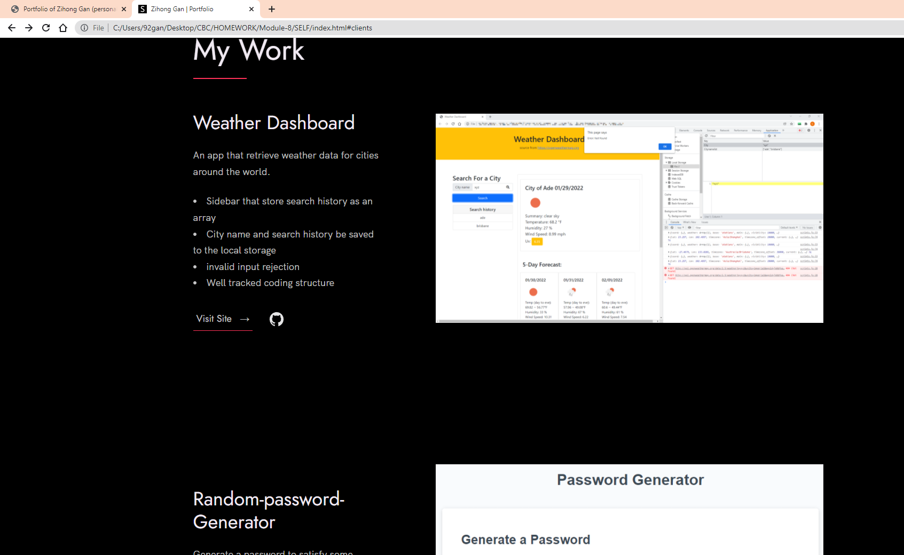
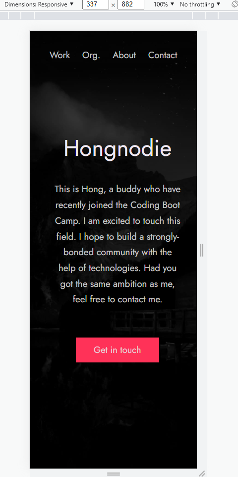

# Updated-Portfolio

This is to update personal portfolio page and other materials to build toward being employer-competitive.

### Link

[Open html page](https://hongnodie.github.io/Updated-Portfolio/)

[See coding files](https://github.com/Hongnodie/Updated-Portfolio.git)

### Aim

Now that some practice with APIs been done and some projects to share, this is to update portfolio page and other materials to build toward being employer-competitive.
Even if opting out of career services, this is *still a required task*. Part of being a web developer means being a part of a community. Having a place to share your projects is *necessary* if you're applying for jobs, but it's also *critical* on your journey as a developer.

### Updates

* Updated portfolio featuring Project 1 and two exemplary homework assignments.

* Updated GitHub profile with pinned repositories featuring Project 1 and two exemplary assignments.

* Updated resume

* Updated LinkedIn profile

### Screenshot

The screenshot

Responsive design

### license

This is licensed under MIT
